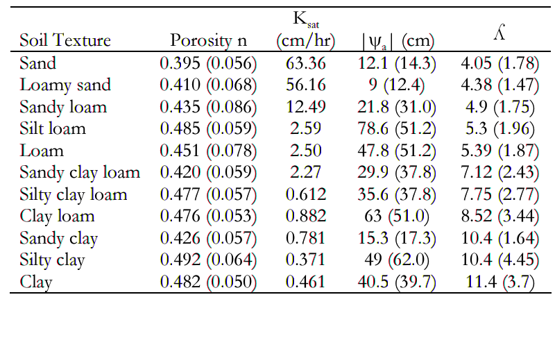
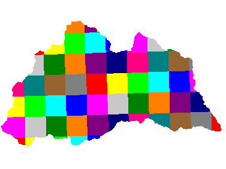

.. |ech2o| replace:: EcH\ :sub:`2`\ O

Model set-up
============

Introduction
------------

The CSF PCRaster format
~~~~~~~~~~~~~~~~~~~~~~~

|ech2o|-iso reads spatial information using the binary raster format
(cross-system format, CSF) used in the free GIS `PCRaster <http://pcraster.geo.uu.nl>`_. By using
this format, full GIS capability for data pre-processing,
post-processing and visualization is added to |ech2o|-iso.

The configuration files
~~~~~~~~~~~~~~~~~~~~~~~

The configuration files are the main communication interface with |ech2o|-iso. They are
plain text files with pairs of keywords and values that provides the
information that needs to run. This includes information on the location
of the inputs/outputs files, simulation and time step length, module options and the
choice of state and diagnostic variables that the user wants reported
(written) to the drive.

There are **two** configurations files:

* The *main configuration file* (defaut name: config.ini), called in the execution command of |ech2o|-iso.  The list of keywords in the current version of the main configuration file (v1.7) is shown `here <http://ech2o-iso.readthedocs.io/en/latest/Keywords.html>`_.
* The *tracking configuration file* (default name: configTrck.ini), whose location is defined in main configuration file and read *only if* water isotopes and/or age tracking is activated (keyword *Tracking* set to 1). The list of keywords in the current version of the tracking configuration file (v1.0) is shown `here <http://ech2o-iso.readthedocs.io/en/latest/KeywordsTrck.html>`_.

Preparing the database
----------------------

Creating a base map and importing the elevation model
~~~~~~~~~~~~~~~~~~~~~~~~~~~~~~~~~~~~~~~~~~~~~~~~~~~~~

The first recommended step in the preparation of the database to run is
to prepare a base map holding information on the geometry of the domain
grid (dimension, resolution, etc). This map can be generated when
importing the digital elevation model (DEM) basemap as explained below.

The easiest way to generate the base maps is to obtain a DEM in ArcInfo
ascii raster format. needs that all maps are in planar coordinates, with
lat-long coordinates in meters, such as the UTM projection. If the map
is obtained in other projection using degrees a reprojection of the map
is necessary using ArcGIS or any other external tool.

Move to the example folder provided with the package, open the file
named with a text editor and check the metadata header with information
on the geometry of the raster image.

Within the PCRaster environment, type

::

    mapattr base.map

to start the interface and create a new blank base map named . Introduce
the number of rows and columns as indicated in the metadata of the ascii
raster image. Choose the *’scalar’* datatype and the *’small real’* cell
representation. If the projection is UTM you may want to indicate a *’y
increases from bottom to top’* projection. Provide the coordinates for
the x upper left corner and for the y upper left corner and the cell
resolution.

Please, note that the ArcInfo standard provides information for the
lower left corner. You can calculate the value of the upper left y
coordinate by adding to the lower left coordinate the result of
multiplying the number of rows by the resolution.

Once this information is provided, hit ’q’ and answer ’y’ to write the
newly created map to the drive. Display the map to ensure it has the
correct dimensions:

::

    aguila base.map

This base map will be used to import all other maps and to ensure all
the maps in the database have the exact same geometry. To import the
ArcInfo DEM map into the CSF PCRaster format type

::

    asc2map -a --clone base.map dem.asc dem.map

This command indicates that we are importing an ascii file named into
the PCRaster format with name , that the imported file has ArcInfo ascii
grid format and that we are cloning the geometry of our base.map.

Display the map to check it has been correctly imported

::

    aguila dem.map

To display it in 3D you can type

::

    aguila -3 dem.map

These maps will form the core of the database from which many of the
other necessary maps can be derived.

Delineating the drainage network
~~~~~~~~~~~~~~~~~~~~~~~~~~~~~~~~

The drainage network is derived from the DEM using a steepest-descent
algorithm on the 8 neighbor window around each cell. From a PCRaster
environment type the command

::

    pcrcalc ldd.map = lddcreate(dem.map, 1e9,1e9,1e9,1e9)

This command instructs PCRaster to calculate the local drainage
direction (ldd) for each cell using the dem (``DEM.map``) and save the drainage
network in a map called . The large numbers included as the final four
arguments to the lddcreate function are options to remove pits and core
areas (see PCRaster documentation on lddcreate for more details).
Display the results with aguila to visually inspect the drainage
network. You may have to zoom in to see the details of the network.

Pits and outlets are coded with the value 5 in the resulting map. These
cells flow nowhere and are considered flow sinks. There is at least one
sink in each basin (the outlet). Mostly we will want to have a
continuous flow network towards the outlet (unless we are working on a
karst area or similar), so if we see internal flow sinks it may be due
to errors in the DEM that to some extent can be corrected with some of
the functions in PCRaster (see PCRaster documentation for this)

.. Important:: 
  For technical reasons, |ech2o|-iso needs a buffer of at least 1 cell of
  no-data (MV) around the drainage network (i.e. the edges of the ldd 
  image must be no-data or missing value cells). The easiest way is to
  calculate the ldd from a DEM image that has blank cells (no data or 
  missing values) beyond the domain of interest and that the domain of
  interest does not reach the edge of the image.

Soil characteristics and surface properties
~~~~~~~~~~~~~~~~~~~~~~~~~~~~~~~~~~~~~~~~~~~

needs information on the surface characteristics (slope and rugosity)
and soil characteristics (porosity, depth, etc) of the area of interest.
Because this information is spatially variable, it is introduce in as
maps. While some terrain properties such as its slope can be directly
calculated from the DEM, information on the spatial distribution of most
other properties listed in Table 1 need to be obtained from
surveys, external databases such as SSURGO, CONUS-SOIL, etc  (e.g. http://www.soilinfo.psu.edu).

+--------------------------------+------------------------+
| Property                       | Units                  |
+================================+========================+
| Slope                          | :math:`m m^{-1}`       |
+--------------------------------+------------------------+
| Rugosity                       | :math:`m`              |
+--------------------------------+------------------------+
| Hydraulic conductivity         | :math:`m s^{-1}`       |
+--------------------------------+------------------------+
| Porosity                       | :math:`m^{3} m^{-3}`   |
+--------------------------------+------------------------+
| Air entry pressure             | :math:`m`              |
+--------------------------------+------------------------+
| Brooks Corey :math:`\lambda`   | :math:`-`              |
+--------------------------------+------------------------+
| Residual soil moisture         | :math:`m^{3} m^{-3}`   |
+--------------------------------+------------------------+
| Soil depth                     | :math:`m`              |
+--------------------------------+------------------------+
| Veg wat use par 1              | :math:`-`              |
+--------------------------------+------------------------+
| Veg wat use par 2              | :math:`-`              |
+--------------------------------+------------------------+

**Table 1.** Soil/surface properties and corresponding units needed to run |ech2o|-iso.

The :math:`\lambda` parameter in the Brooks and Corey model is the
inverse of the pore size distribution index. Typical values for the
Books and Corey :math:`\lambda` for a number of textures is shows in
Fig. 1.

   **Figure 1.** Brooke and Corey soil parameters for different texstures. *From
   Dingman, L(2002). Physical Hydrology, 2nd Ed.Prentice Hall, 646p*.

Climate files
-------------

organizes the climate data in a set of binary files containing the
necessary information to construct the time dependent spatial fields of
atmospheric inputs. All maps related to climate must be placed in the
folder identified in the ``Clim_Maps_Folder`` key of the main configuration
file.

The spatial distribution of climate data is done according to discrete
climate zones with unique identifiers that define areas of the domain
with constant values for a given climate input. These climate zones can
be constructed using Voronoi polygons, using irregular regions following
elevation and aspect bands, or simply using a regular orthogonal spatial
grid. This information on the climate zones is provided as a CSF
PcRaster map. Figure 2 is an example of a climate zone map
using an orthogonal grid.

   **Figure 2.** Example of a climate zone map using a regular grid to accommodate
   input form a regional climate model

A time series of climate information for each specific climate zone is
associated with each of these zones through a unique identifier that
links the climate zone and a specific column of the binary climate file.

reads climate files in a specific binary format that can be constructed
from a text file using the utility provided with . The format of the
text file needed to run is explained below and summarized in Box 1.
Data must be space or tab separated except the first
line that must end with a carriage return.

::

    Comment [up to 256] (character)
    NumTimeSteps [1] (integer number)
    TimeSteps [NumTimeSteps] (real number)
    NumZones [1] (integer number)
    ZoneId [NumZones] (integer number)
    Data [NumTimeSteps x NumZones] (real number)

**Box 1.** ASCII climate file format. The number in square
brackets is the number items allowed of the type indicated in
parentheses

The first line of the file is a user’s comment that typically includes a
desciption of the contents of the file such as the what variable is
represented in the file (precipitation, air temperature, etc), its
source, units, etc. The size of the comment cannot exceed 256 characters
including white spaces. The line may be left blank but the line must
still exist (i.e. even if there is no information there must be a blank
line).

The second line is the number of time steps included in the database. It
must be a single integer.

The next line identifies the time steps in arbitrary units (e.g. 0.5 1
1.5... hours or 1 2 3 4... days). it is a space- or tab-separated list
of real numbers containing exactly ``NumTimeSteps`` elements. The
elements in this list are read with single precision (32 bits).

The next line is the number of spatial climate zones for which a time
series is provided in the file. It must be a single integer.

The next line lists the climate zone identifiers as per the climate zone
map that will be used during the simulations. This list is space- or
tab-separated containing exactly ``NumZones`` integer numbers.

The final group of numbers contains the actual climate data. It is a
matrix of real numbers with ``NumTimeSteps`` rows (a row per time step)
and ``NumZones`` columns (one column per time zone listed in the
header). Each column representing data for a zone must be ordered
according to the order the zones were listed in the header. Elements in
this matrix are read with single precision (32 bits).

An example of a climate file correctly formatted is:

::

    Windspeed in m/s. Station 1b2. J Doe
    4
    0.5 1 1.5 2
    2 
    1 2
    2.4 2.1
    2.0 2.8
    1.9 2.0
    0.5 1.2

**Box 2.** Example of ascii climate file with 4 time steps
(0.5, 1, 1.5, and 2) and 2 climate zones (1 and 2)

Text files with this format need to be converted into the appropriate
binary climate format used by using the provided utility

::

    asc2c input_text_file.asc output.bin

Where represents the name of the appropriately formatted text file
containing the climate data and represents the name that will use to
write the resulting binary file. The format of the binary file follows
the same structure of the ascii file using 8 bit characters, 32 bit
signed integers, and 32 bit signed floats.

Eight climate variables are needed to run , each in its own binary file.
expects the data in the files to be in some specific units. Table 2 
lists the eight needed climate variables and the
corresponding units in which the data must be provided.
If water isotope tracking is activated, the corresponding climate inputs must be provided (Table 2).

**Table 2.** Variables and associated units of climate forcings used by |ech2o|-iso.

+------------------------------+------------------------+---------------------------------------------+
| Variable                     | Unit                   | Comment                                     |
+==============================+========================+=============================================+
| Precipitation                | :math:`ms^{1}`         | \-                                          |
+------------------------------+------------------------+---------------------------------------------+
| Average air temperature      | :math:`^{\circ}C`      | \-                                          |
+------------------------------+------------------------+---------------------------------------------+
| Maximum air temperature      | :math:`^{\circ}C`      | \-                                          |
+------------------------------+------------------------+---------------------------------------------+
| Minimum air temperature      | :math:`^{\circ}C`      | \-                                          |
+------------------------------+------------------------+---------------------------------------------+
| Relative Humidity            | fraction of saturation | \-                                          |
+------------------------------+------------------------+---------------------------------------------+
| Wind speed                   | :math:`ms^{-1}`        | \-                                          |
+------------------------------+------------------------+---------------------------------------------+
| Incoming long wave radiation | :math:`Wm^{-2}`        | \-                                          |
+------------------------------+------------------------+---------------------------------------------+
| Incoming solar radiation     | :math:`Wm^{-2}`        | \-                                          |
+------------------------------+------------------------+---------------------------------------------+
| Deuterium content in precip  | ‰                      | | Needed only if ``Tracking = 1``  an       |
|                              |                        | | ``water_dD = 1`` in configuration files   |
+------------------------------+------------------------+---------------------------------------------+
| Oxygen 18 content in precip  | ‰                      | | Needed only if ``Tracking = 1`` and       |
|                              |                        | | ``water_d18O = 1`` in configuration files |
+------------------------------+------------------------+---------------------------------------------+

Two additional files in CSF PCRaster map format are necessary in
``Clim_Maps_Folder``, one is a map with the temperature threshold (in
:math:`^\circ C`) for rain to snow transition. This map can be constant
or the threshold can change in space. The second file is a convenience
map of precipitation multiplication factors that permits to manipulate
and improve the spatial distribution of precipitation even when using
coarse climate zones. The precipitation assigned to a pixel in the
climate zone from the corresponding *.bin* file will be multiplied by
the factor specified in the same pixel of this map before being used in
.

Forest and species data
-----------------------

In this version is designed to simulate evergreen vegetation and a
herbaceous understory. It is also designed to broad types of vegetation
(e.g. firs, pines) with a general functional behavior instead of
simulating specific species. Multiple vegetation types can be simulated,
the number of them is supplied in the ``Number_of_Species`` keyword of
the configuration file.

Two types of information are needed to set up the ecological module: 

1. vegetation parameters,
2. initial condition of the state variables tracked.

Vegetation Parameters file
~~~~~~~~~~~~~~~~~~~~~~~~~~

The vegetation parameters file must be located in the ``Maps_Folder``
folder indicated in the configuration file. The name of the file must be
indicated in the ``Species_Parameters`` keyword.

The contents of the file is ascii text that describes the functional
characteristics of the different vegetation types that will be included
in the simulation. It contains the time-invariant parameters that define
the behavior of plants.

The first line of the file contains two tab- or space-separated
integers. The first integer indicates the number of vegetation types
included in the file. The second integer must be the number 39, which is
the number of information items that needs to be supplied for each
vegetation type.

Below the first line there will be a line per vegetation type containing
39 items of information. The format and items of information are listed
in Box 3 and below.

**Box 3.** Format of the vegetation parameters file.

::

    line 1: numSpecs	NumParams												
    In each line from line 1 to line numSpecs+1: 39 Comma or
    tab separated numbers with the following elements:

    SpeciesID NPP/GPPRatio	gsmax	CanopyQuantumEffic
    MaxForestAge OptimalTemp MaxTemp MinTemp 
    FoliageAllocCoef_a	FoliageAllocCoef_b 
    StemAllocCoef_a	StemAllocCoef_b	gs_light_coeff	gs_vpd_coeff
    gs_psi_d gs_psi_c WiltingPnt	SpecificLeafArea
     SpecificRootArea Crown2StemDRat 
    TreeShapeParam	WoodDens Fhdmax	Fhdmin LeafTurnoverRate
    MaxLeafTurnoverWaterStress LeafTurnoverWaterStressParam
    MaxLeafTurnoverTempStress LeafTurnoverTempStressParam
    ColdStressParam	RootTurnoverRate MaxCanStorageParam albedo
    emissivity	KBeers	CanopyWatEffic 
    vegtype 
    DeadGrassLeafTurnoverRate DeadGrassLeafTurnoverTempAdjustment 

SpeciesID
    A unique vegetation identifier (integer).

NPP/GPPRatio
    A NPP to GPP ratio representing a constant respiration loss. Positive real smaller than 1. Typical value around 0.47

gsmax
    Maximum stomatal conductance in :math:`ms^{-1}`. Typical value around 0.009

CanopyQuantumEffic
    Canopy quantum efficiency representing the light use efficiency, in :math:`gCJ^{-1}` (grams of carbon per absorbed joule of photosynthetically active radiation. Typical value around 0.0000018

MaxForestAge
    Typical maximum age for the vegetation, in years

OptimalTemp
    Optimal growth temperature for the vegetation type, in degrees C

MaxTemp
    Maximum temperature of comfort for the species, in degrees C

MinTemp
    Minimum temperature of comfort for the species, in degrees C

FoliageAllocCoef\_a
    Foliage allocation coefficient as per 3PG model if ``vegtype=0`` (typical value around 2.235). Dead grass turnover rate (in :math:`m^2KgC^{-1}`) if ``vegtype=1``. Minimum root allocation factor if ``vegtype=2``.

FoliageAllocCoef\_b
    Foliage allocation coefficient as per 3PG model if ``vegtype=0`` (typical value around 0.006). Dead grass leaf turnover adjustment rate (in :math:`m^2KgC^{-1}`) if ``vegtype = 1``. Minimum stem allocation factor if ``vegtype=2``

StemAllocCoef\_a
    Stem allocation coefficient as per 3PG model  if ``vegtype=0`` (typical value around 3.3). Coefficient n for allocation of NPP to stems if ``vegtype=1``. Allocation parameter (modulates water and light effect) if ``vegtype=2``.

StemAllocCoef\_b
    Stem allocation coefficient as per 3PG model. Typical value around 0.0000006

gs\_light\_coeff
    Parameter controlling stomatal sensitivity to light. Typical value around 300

gs\_vpd\_coeff 
    Parameter controlling stomatal sensitivity to vapor pressure deficit. Typical value around 0.002

lwp_min
    Lowest leaf water potential before stomatal function shuts down, in -MPa. Typical value around 3.92 (-400 m of head)

lwp_max
    Leaf water potential threshold beyond which stomatal efficiency is maximal, in -MPa. Typical value around 0.069 (-7 m of head)

WiltingPnt
    Volumetric soil water content at wilting point, dependent on plant and soil characteristics.

SpecificLeafArea
    Specific leaf area, in :math:`m^2KgC^{-1}`

SpecificRootArea
    Specific root area, in :math:`m^2KgC^{-1}`

Crown2StemDRat
    Allometric parameter controlling the crown to stem diameter ratio as per TreeDyn.

TreeShapeParam
    Tree shape parameter as per TreeDyn. An often appropriate value is 0.4

WoodDens
    Wood density, in :math:`gCm^{-2}`

Fhdmax
    Maximum allowed ratio of tree height to stem diameter (0 to 1).

Fhdmin
    Minimum allowed ratio of tree height to stem diameter (0 to 1).

LeafTurnoverRate
    Base leaf turnover rate, in :math:`s^{-1}`

MaxLeafTurnoverWaterStress
    Maximum leaf turnover rate due to water stress, in :math:`s^{-1}`

LeafTurnoverWaterStressParam
    Parameter controlling increased leaf turnover due to water stress

MaxLeafTurnoverTempStress
    Maximum leaf turnover rate due to temperature stress, in :math:`s^{-1}`

LeafTurnoverTempStressParam
    Parameter controlling increased leaf turnover due to temperature stress

ColdStressParam
    (degC)

RootTurnoverRate
    Base root turnover rate, in :math:`s^{-1}`

MaxCanStorageParam
    Maximum water storage capacity of the canopy, in :math:`m`

albedo
    Albedo of vegetation

emissivity
    Emissivity of vegetation

KBeers
    Light extinction coefficient for the canopy as per Beer’s law

CanopyWatEffic
    Water use efficiency of the canopy, in terms of grams of carbon assimilated per meter of transpired water, :math:`gCm^{-1}`

Kroot
    Exponential root profile coefficient, :math:`m^{-1}`

vegtype
    Switch that indicates if the vegetation type is evergreen trees (0), herbaceous (1) or deciduous trees (2)

DeadGrassLeafTurnoverRate
    Base Rate of decomposition of dry grass leaves, :math:`s^{-1}`. The value is used only if ``vegtype`` = 1 although a value needs to be supplied in all cases

DeadGrassLeafTurnoverTempAdjustment
    Temperature threshold that triggers the decomposition of dry grass leaves, :math:`\deg C`. The value is used only if ``vegtype`` = 1 although a value needs to be supplied in all cases

Initial conditions for vegetation state variables
~~~~~~~~~~~~~~~~~~~~~~~~~~~~~~~~~~~~~~~~~~~~~~~~~

Information on the density of trees, relative canopy cover, root
density, leaf area index, vegetation age, vegetation effective height,
and tree basal area is necessary to initialize the status of vegetation.
There is two ways to provide this information: using tables and using
maps.

Initialization using tables
~~~~~~~~~~~~~~~~~~~~~~~~~~~

Initialization of the state variables for vegetation using tables is
often easier during the first model run. |ech2o|-iso can be initialized with tables
by setting ``Species_State_Variable_Input_Method`` = tables in the
configuration file.

This type of initialization relies on the concept of *’vegetation
patches’*, which are discrete, arbitrarily-shaped regions in the study
area where vegetation is initialized with constant values. A patch can
have multiple vegetation types, each identified with the ``SpeciesID``
listed in the vegetation parameter file.

Patches are given to as a map in the ``ForestPatches`` keyword of the
configuration file. This map must be included in the ``Maps_Folder``
folder indicated in the configuration file. The map contains at least
one discrete region (patch) identified with an integer. Please note that
patches need not be continuous. A patch can be composed of different
disconnected small regions scattered through the domain with the same
integer identifier.

The initialization of vegetation types in each path is done through a
number of ascii tables with a format described below. The tables must be
placed in the ``Maps_Folder`` folder indicated in the configuration file
and the names for each variable paired with the appropriate key in the
configuration file. A description of the tables is given below

Species\_Proportion\_Table
    Table containing the proportion of each patch that is occupied by each vegetation type. In the current version of the model this is a time-invariant variable since there is no vegetation dispersal and encroachment module. If a vegetation type does not exist for a patch, indicate a zero in the column for that species in a patch.

Species\_StemDensity\_Table 
    Table containing the tree density of each vegetation type in their share of patch, in trees per sq. meter. In the current version of the model this is a time-invariant variable since there is no vegetation dispersal and encroachment module.

Species\_LAI\_Table 
    Table containing the initial LAI of each vegetation type. note that LAI is defined as the area of leaves over the projected canopy area and not area of leaves over patch or pixel area.

Species\_AGE\_Table 
    Table containing the average age of trees of each vegetation type in each patch. In years.

Species\_BasalArea\_Table 
    Table containing the total basal area of each type of vegetation in each patch, in square meters.

Species\_Height\_table 
    Table containing the effective height of each type of vegetation in each patch, in meters.

Species\_RootMass\_table 
    Table containing the average root mass of each type of vegetation in each patch, in grams per square meters.

All tables have identical format as described in Box 4.

::

    line 1: numPatches	NumSpecies+1
    In each line from line 1 to line numPatches+1: PatchID
    followed by NumSpecies comma or tab separated
    numbers with initial information on vegetation variables.
    The information for each vegetation type is listed in 
    the same order they appear in the vegetation parameter
    file.

**Box 4.** Format of the vegetation variables file

numPatches
    Number of patches with unique identifiers in file associated to *ForestPatches*.

NumSpecies
    Is the number o simulated vegetation types.

PatchID
    The unique integer identifier for the vegetation patch as identified in the patch map.

.. Important:: 
  The information for the vegetation type is introduced
  in the order in which the vegetation types are listed in the
  vegetation parameterfile (i.e. first number after the ``PatchID`` item
  corresponds to the topmost vegetation type listed in the vegetation
  parameter file, and so on.

Initialization using maps
~~~~~~~~~~~~~~~~~~~~~~~~~

If distributed information is available to initialize the vegetation
variables or if a complete run has already been performed it is possible
to initialize the variables using maps instead of tables and provide
variability within each patch.

To initialize the vegetation variables this way set
``Species_State_Variable_Input_Method`` = *maps* in the configuration
file. With the configuration, will look for the following maps in the
folder specified in ``Maps_Folder``.

The species are identifying by an index within square brackets in the
file name. The index starts at 0, which identifying the topmost
vegetation type identifyed in the vegetation parameter file (e.g. for a
run with two vegetation types the leaf area index is initialized with
two maps, for example ``lai_0.map`` and ``lai_1.map``, corresponding to the first and
second vegetation types listed in the vegetation parameter file).

p\_0,...,NumSpecies-1.map
    One map per vegetation type included in the simulation. The map contains the proportion of each pixel occupied by the vegetation type identifying by the index in the file name.

root\_0,...,NumSpecies-1.map
    One map per vegetation type included in the simulation. The map contains the root mass of the vegetation type identifying by the index in the file name, in :math:`g\cdot m{-2}`

ntr\_0,...,NumSpecies-1.map
    One map per vegetation type included in the simulation. The map contains density of trees in the area of each pixel ocuppied by the vegetation type identified by the index in the file name. Trees per sq.meter.

lai\_0,...,NumSpecies-1.map
    One map per vegetation type included in the simulation. The map contains the initial leaf area index in each pixel of the vegetation type identified by the index in the file name.

hgt\_0,...,NumSpecies-1.map
    One map per vegetation type included in the simulation. The map contains the effective height in each pixel of the vegetation type identified by the index in the file name. In meters.

bas\_0,...,NumSpecies-1.map
    One map per vegetation type included in the simulation. The map contains the total basal area in each pixel of the vegetation type identified by the index in the file name. In sq. meters.

age\_0,...,NumSpecies-1.map
    One map per vegetation type included in the simulation. The map contains the age in each pixel of the vegetation type identified by the index in the file name. In years.

A way to produce these maps is to turn on the reporting flag for these
maps during an initial run of using tables. Then rename the last time
step of the corresponding files in the results folder with the
appropriate names and copy these files to the maps folder. The case
study included in this manual explains how initialize the model using
this technique.
