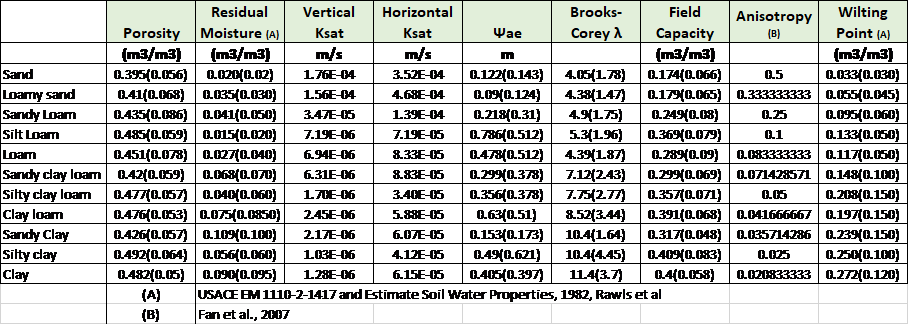

# EcH2O Modelling: Data Requirements &  Parameters

## Data Requirements

### 1\.	Climate

	a. *Input files*

All data as input binary files must be complete time-series (no NaN values). Gap-filling missing data is required prior to its use in EcH2O. There is currently no way to gap-fill data within EcH2O.

|                                                    |     Units       |     Notes                                                                                                                                                                                          |     File Format    |   |
|----------------------------------------------------|-----------------|----------------------------------------------------------------------------------------------------------------------------------------------------------------------------------------------------|--------------------|---|
|     Precipitation                                  |     m s-1       |     Specify the number of climate   zone                                                                                                                                                           |     Binary         |   |
|     Average Temperature (time-step   dependent)    |     oC          |     Specify the number of climate zone                                                                                                                                                             |     Binary         |   |
|     Maximum Temperature (time-step   dependent)    |     oC          |     Specify the number of climate   zone                                                                                                                                                           |     Binary         |   |
|     Minimum Temperature (time-step   dependent)    |     oC          |     Specify the number of climate zone                                                                                                                                                             |     Binary         |   |
|     Relative Humidity                              |     fraction    |     Specify the number of climate   zone                                                                                                                                                           |     Binary         |   |
|     Wind Speed                                     |     m s-1       |     Specify the number of climate zone                                                                                                                                                             |     Binary         |   |
|     Incoming longwave radiation                    |     W m-2       |     Specify the number of climate   zone                                                                                                                                                           |     Binary         |   |
|     Incoming shortwave radiation                   |     W m-2       |     Specify the number of climate zone                                                                                                                                                             |     Binary         |   |
|     Air Pressure                                   |     Pa          |     Specify the number of climate   zone                                                                                                                                                           |     Binary         |   |
|     Anthropogenic Heat (Optional)                  |     W/m2        |     Specify the number of climate zone                                                                                                                                                             |     Binary         |   |
|     Climate Zones Map                              |     N/A         |     Specifies the locations of each climate   zone (integers)                                                                                                                                      |     .map           |   |
|     Isohyet Map                                    |     N/A         |     Randomly reallocates the precipitation input using a   modification factor. Modification factors generally set between 0.5 and 1.5   (1 indicates no difference to the precipitation input)    |     .map           |   |
|     Temperature threshold for snow   vs. rain      |     oC          |     Not typically parameterized and   set to 2oC in the config.ini file. Optional to input the threshold   as a map (constant in time)                                                             |     N/A            |   |

Additional input for EcH2O-iso

|              |     Units    |     Notes                                   |     File Format    |   |
|--------------|--------------|---------------------------------------------|--------------------|---|
|     δ2H      |     ‰        |     Specify the number of climate   zone    |     Binary         |   |
|     δ18O     |     ‰        |     Specify the number of climate zone      |     Binary         |   |

	b. *Parameterisation*

There is little parameterization with the climate files. Parameterization only occurs with: 

|     Parameter                                         |     Effect                                                                                                                                                                                          |
|-------------------------------------------------------|-----------------------------------------------------------------------------------------------------------------------------------------------------------------------------------------------------|
|     Specification of the number of   climate zones    |     Spatially influences climate   inputs. Useful for: large catchment area (convective influence or rainout   processes), large changes in elevation (eg. Influence on isotopic   compositions)    |
|     Creation of isohyet maps                          |     Randomization of isohyet map helps to compensate for   spatial variability in precipitation occurring between weather stations.                                                                 |
|     Temperature threshold                             |     Temperature threshold is   generally held at 2oC for most simulations. Decreasing the value   will result in more rainy days rather than snowpack development                                   |

### 2\.	Surface and Soils

	a. *Input files*

The input files for soils are all input as .map files with the same grid size, number of grids squares, and catchment shape. It is ESSENTIAL to ensure the following:
1.	there is a row and column of values (no data values) surrounding each map file. Without the row and columns, EcH2O will NOT read in the map files correctly. 
2.	The channel files are completed maps with 0 values where there are no channels within the catchment (no data values outside the catchment area)
3.	Drainage must always drain toward the outlet (i.e. the lowest value in the D8 method is not in the center when not at the catchment outlet). Low points in the DEM MUST be filled.

|                                                   |     Units    |     Notes                                                                                                                      |     File Format    |
|---------------------------------------------------|--------------|--------------------------------------------------------------------------------------------------------------------------------|--------------------|
|     Local   drainage direction (ldd)              |     N/A      |     D8 method for   determining which direction groundwater/surface water moves                                                |     .map           |
|     Channel width      (chanwidth)                |     m        |     Channel width in cells containing   channels                                                                               |     .map           |
|     Channel   length (chanlength)                 |     m        |     Channel length   in cells containing channels                                                                              |     .map           |
|     Fraction of   impervious surface (fImperv)    |     -        |     Fraction of impervious surface   coverage to total cell surface area. This ratio is the amount that will NOT infiltrate    |     .map           |
|     Fraction of   contributing area (fcontrea)    |     -        |     Fraction of cell   that contributes to catchment runoff.                                                                   |     .map           |
|     DEM                                           |     m        |     DEM must be filled for all   catchment low points                                                                          |     .map           |
|     Slope                                         |     m/m      |     Resolved using   the DEM with the location drainage direction                                                              |     .map           |

In addition to the input parameterization maps, EcH2O requires initialization maps.

|                                                         |     Units       |     Notes                                                                                                                                      |     File Format    |
|---------------------------------------------------------|-----------------|------------------------------------------------------------------------------------------------------------------------------------------------|--------------------|
|     Initial   Streamflow                                |     m3 s-1      |     Input values can   be taken as 0 since spin-up in most catchments will resolve this.                                                       |     .map           |
|     Snow Water   Equivalent                             |     M           |     Starting the simulations at the   beginning of the water year (Oct 1) allows for the initial condition to be 0m                            |     .map           |
|     Soil moisture   in Layer 1                          |     fraction    |     Generally set to   0.75 of the porosity of the soil in Layer 1                                                                             |     .map           |
|     Soil moisture   in Layer 2                          |     fraction    |     Generally set to 0.75 of the   porosity of the soil in Layer 2                                                                             |     .map           |
|     Soil moisture   in Layer 3                          |     fraction    |     Generally set to   0.75 of the porosity of the soil in Layer 3                                                                             |     .map           |
|     Soil   Temperature                                  |     oC          |     Similar to initial streamflow,   spin-up of the model resolves this initial condition. If unknown general safe   estimations are 5-10oC    |     .map           |
|     Surface   boundary condition (optional)             |     m3 s-1      |     Input time   series of surface water input (channel cells only – for irrigation add water   to precipitation input)                        |     .bin           |
|     Groundwater   boundary condition (optional)         |     m2 s-1      |     Input time series of groundwater   input                                                                                                   |     .bin           |
|     Deep   groundwater boundary condition (optional)    |     m2 s-1      |     Input time   series of deep groundwater input                                                                                              |     .bin           |

With the inclusion of the isotope portion of EcH2O, there are additional initial files.

|                                   |     Units    |     Notes                                                                                                                                                                                                                                                                        |     File Format    |
|-----------------------------------|--------------|----------------------------------------------------------------------------------------------------------------------------------------------------------------------------------------------------------------------------------------------------------------------------------|--------------------|
|     δ2H   snowpack                |     ‰        |     Initial   deuterium of the snowpack                                                                                                                                                                                                                                          |     .map           |
|     δ2H   surface                 |     ‰        |     Initial deuterium of the surface   water                                                                                                                                                                                                                                     |     .map           |
|     δ2H   soil in Layer 1         |     ‰        |                                                                                                                                                                                                                                                                                  |     .map           |
|     δ2H   soil in Layer 2         |     ‰        |                                                                                                                                                                                                                                                                                  |     .map           |
|     δ2H   soil in Layer 3         |     ‰        |     The turnover of   Layer 3is quite slow since the depth is usually deep, so the initial   conditions are IMPORTANT                                                                                                                                                            |     .map           |
|     δ2H   soil in groundwater     |     ‰        |     The turnover of groundwater is   quite slow, so the initial conditions are IMPORTANT                                                                                                                                                                                         |     .map           |
|     δ2H   BC surface              |     ‰        |     Input timeseries   of input surface water deuterium                                                                                                                                                                                                                          |     .bin           |
|     δ2H   BC groundwater          |     ‰        |     Input timeseries of input   groundwater water deuterium                                                                                                                                                                                                                      |     .bin           |
|     δ2H   BC deep groundwater     |     ‰        |     Input timeseries   of input deep groundwater water deuterium                                                                                                                                                                                                                 |     .bin           |
|     δ18O   soil in Layer 1        |     ‰        |                                                                                                                                                                                                                                                                                  |     .map           |
|     δ18O   soil in Layer 2        |     ‰        |                                                                                                                                                                                                                                                                                  |     .map           |
|     δ18O   soil in Layer 3        |     ‰        |     The turnover of Layer 3 is quite   slow since the depth is usually deep, so the initial conditions are IMPORTANT                                                                                                                                                             |     .map           |
|     δ18O   soil in groundwater    |     ‰        |     The turnover of   groundwater is quite slow, so the initial conditions are IMPORTANT                                                                                                                                                                                         |     .map           |
|     δ18O   BC surface             |     ‰        |     Input timeseries of input surface   water oxygen-18                                                                                                                                                                                                                          |     .bin           |
|     δ18O   BC groundwater         |     ‰        |     Input timeseries   of input groundwater water oxygen-18                                                                                                                                                                                                                      |     .bin           |
|     δ18O   BC deep groundwater    |     ‰        |     Input timeseries of input deep   groundwater water oxygen-18                                                                                                                                                                                                                 |     .bin           |
|     Age soil in   Layer 1         |     Days     |                                                                                                                                                                                                                                                                                  |     .map           |
|     Age soil in   Layer 2         |     Days     |                                                                                                                                                                                                                                                                                  |     .map           |
|     Age soil in   Layer 3         |     Days     |     The turnover of   Layer 3 is quite slow since the depth is usually deep, so the initial   conditions are IMPORTANT. Suggest to   run with initial condition of 0 days and re-running the simulation with the   end soil age as the initial conditions until convergence.     |     .map           |
|     Age soil in   groundwater     |     Days     |     See age soil in Layer 3                                                                                                                                                                                                                                                      |     .map           |
|     Age BC   surface              |     Days     |     Input timeseries   of input surface water age                                                                                                                                                                                                                                |     .bin           |
|     Age BC   groundwater          |     Days     |     Input timeseries of input   groundwater water age                                                                                                                                                                                                                            |     .bin           |
|     Age BC deep   groundwater     |     Days     |     Input timeseries   of input deep groundwater water age                                                                                                                                                                                                                       |     .bin           |

	b. *Parameterisation*

The soils have a large number of calibration parameters related to both the water balance and the energy balance. The parameters are specific to soil types within the catchment. High detail on the soil maps will help to constrain the simulations. 

|                                                                            |     Units         |     Notes                                                                                                                                                  |     File Format    |
|----------------------------------------------------------------------------|-------------------|------------------------------------------------------------------------------------------------------------------------------------------------------------|--------------------|
|     Channel to   groundwater leakance (chanparam)                          |     N/A           |     The fraction of   water in the channel that is lost to leakance into the groundwater                                                                   |     .map           |
|     Manning’s n   (chanmanningn)                                           |     s m (-1/3)    |     Manning’s roughness parameter –   use standard values                                                                                                  |     .map           |
|     Horizontal   hydraulic conductivity (Keff)                             |     m s-1         |     Lateral hydraulic   conductivity                                                                                                                       |     .map           |
|     Surface   horizontal hydraulic conductivity (Keff)                     |     m s-1         |     Lateral hydraulic conductivity at   the surface (if not using Richard’s use Keff)                                                                      |     .map           |
|     Exponential   decrease in hydraulic conductivity with depth (kKsat)    |     m-1           |     Values of 1.5   result in large changes in hydraulic conductivity with depth, 20 and greater   result in little change with depth.                     |     .map           |
|     Anisotropy   ratio (KvKh)                                              |     m/m           |                                                                                                                                                            |     .map           |
|     Random   surface roughness (randrough)                                 |     m             |     Random roughness   at surface                                                                                                                          |     .map           |
|     Porosity   (poros)                                                     |     m3/m3         |     Porosity in layer 1                                                                                                                                    |     .map           |
|     Exponential   decrease in porosity with depth (kporos)                 |                   |     Values of 1.5   result in large changes in hydraulic conductivity with depth, 20 and greater   result in no change with depth.                         |     .map           |
|     Air-entry   pressure (psi_ae)                                          |     m             |                                                                                                                                                            |     .map           |
|     Brooks Corey   Parameter (BClambda)                                    |                   |                                                                                                                                                            |     .map           |
|     Residual soil   moisture (theta_r)                                     |     m3/m3         |     Need to ensure that the porosity is   always greater than the residual soil moisture                                                                   |     .map           |
|     Depth of   Layer 1                                                     |     m             |                                                                                                                                                            |     .map           |
|     Depth of Layer   2                                                     |     m             |                                                                                                                                                            |     .map           |
|     Depth of   Layer 3                                                     |     m             |                                                                                                                                                            |     .map           |
|     Soil leakance   (leakance)                                             |                   |     In most catchments it is best to   assume that this has a constant value of 0. Used as more of a fitting   parameter unless the water loss is known    |     .map           |
|     Albedo   (albedo)                                                      |                   |                                                                                                                                                            |     .map           |
|     Emissivity   (emiss)                                                   |                   |                                                                                                                                                            |     .map           |
|     Soil Heat   Capacity (soilheatcap)                                     |                   |     Used for   evaporation, root-uptake, and soil frost.                                                                                                   |     .map           |
|     Soil Thermal   conductivity (soilthermalK)                             |     K m2/W        |     Used for evaporation,   root-uptake, and soil frost.                                                                                                   |     .map           |
|     Damping depth   (dampdepth)                                            |     m             |     Theoretical   depth where soil temperature does not change                                                                                             |     .map           |
|     Temperature at   damping depth (temp_damp)                             |     oC            |     Temperature at damping depth                                                                                                                           |     .map           |

### 3\.	Vegetation

The parameters and maps require as inputs for vegetation. All of the input maps need to be created/defined for each vegetation type in the catchment.

	a. *Input files*

|                                 |     Units        |     Notes                                                      | File Format |
|---------------------------------|------------------|----------------------------------------------------------------|-------------|
|     Proportion of vegetation    |                  |     Sum of all vegetation proportions   must be less than 1    |     .map    |
|     Root mass                   |     g m-2        |                                                                |     .map    |
|     Density of vegetation       |     Trees m-2    |                                                                |     .map    |
|     Leaf area index             |     m2/m2        |                                                                |     .map    |
|     Height of vegetation        |     m            |                                                                |     .map    |
|     Basal area                  |     m2           |                                                                |     .map    |
|     Age                         |     years        |     Should be less than the maximum age   of the vegetation    |     .map    |

	b. *Parameterisation*

The parameterization of vegetation is required for each vegetation type.

**NOTE**: the order of vegetation in the SpeciesParams.tab determines which tree species is solved first for water available and for the energy balance. This means that the first vegetation will ALWAYS have the most water and ease for root-uptake.

|                                                        |     Units            |     Notes                                                                                                                                                                                                                     |     File Format    |
|--------------------------------------------------------|----------------------|-------------------------------------------------------------------------------------------------------------------------------------------------------------------------------------------------------------------------------|--------------------|
|     GPP to NPP                                         |                      |                                                                                                                                                                                                                               |     .tab           |
|     Gs max                                             |     m s-1            |     Very sensitive parameter – primarily controls maximum   transpiration rates                                                                                                                                               |     .tab           |
|     Canopy efficiency                                  |     g C J-1          |     Used for light use efficiency –   use in conjunction with water use efficiency. Suggest calibrating only one of   two if used.                                                                                            |     .tab           |
|     Maximum Forest Age                                 |     years            |     Changes energy allocation in the vegetation (root, stem,   leaf)                                                                                                                                                          |     .tab           |
|     Optimal Temperature                                |     oC               |     Highest production at this   temperature (transpiration and growth)                                                                                                                                                       |     .tab           |
|     Maximum Temperature                                |     oC               |     No allocation to growth above this temperature                                                                                                                                                                            |     .tab           |
|     Minimum Temperature                                |     oC               |     No allocation to growth below   this temperature                                                                                                                                                                          |     .tab           |
|     Foliage Allocation a                               |                      |     Used for allocating carbon to leaves                                                                                                                                                                                      |     .tab           |
|     Foliage Allocation b                               |                      |     Used for allocating carbon to   leaves                                                                                                                                                                                    |     .tab           |
|     Stem Allocation a                                  |                      |     Used for allocating carbon to stems                                                                                                                                                                                       |     .tab           |
|     Stem Allocation b                                  |                      |     Used for allocating carbon to   stems                                                                                                                                                                                     |     .tab           |
|     Gs light                                           |                      |     Vegetation stomatal sensitivity to light. Controls   temporal dynamics of transpiration throughout the year. Lower values increase   seasonality.                                                                         |     .tab           |
|     Gs VPD                                             |                      |     Stomatal sensitivity to vapor   pressure deficit.                                                                                                                                                                         |     .tab           |
|     LWP_min                                            |                      |     Stomatal resistance due to soil. With linear model option,   use value of 1 for pressure at wilting point.                                                                                                                |     .tab           |
|     LWP_max                                            |                      |     Stomatal resistance due to soil   moisture. With linear model option, use value > 0 and <1 to range   between porosity and wilting point. Larger values (linear model) reduce   transpiration sensitivity to moisture.    |     .tab           |
|     VCnd_c                                             |                      |     Weibull function parameter for plant hydraulic - Extremely   sensitive parameter – suggest no calibration of this parameter                                                                                               |     .tab           |
|     VCnd_d                                             |     MPa              |     Weibull function parameter for   plant hydraulic - Extremely sensitive parameter – suggest no calibration of this   parameter                                                                                             |     .tab           |
|     VCnd_m                                             |     μm MPa-1 s-1     |     Maximum vegetation conductivity – optional parameter for   plant hydraulics only. Extremely sensitive parameter – suggest no calibration   of this parameter                                                              |     .tab           |
|     Wilting Point                                      |                      |                                                                                                                                                                                                                               |     .tab           |
|     Specific Leaf Area                                 |     m2KgC-1          |     (Used only for leaf loss rates and LAI estimations)                                                                                                                                                                       |     .tab           |
|     Specific Root Area                                 |     m2KgC-1          |     (Used only for root loss rates)                                                                                                                                                                                           |     .tab           |
|     Crown Stem ratio                                   |                      |                                                                                                                                                                                                                               |     .tab           |
|     Tree shape                                         |                      |                                                                                                                                                                                                                               |     .tab           |
|     Wood Density                                       |     gCm-2            |                                                                                                                                                                                                                               |     .tab           |
|     Maximum tree height to stem   diameter ratio       |                      |                                                                                                                                                                                                                               |     .tab           |
|     Minimum tree height to stem   diameter ratio       |                      |                                                                                                                                                                                                                               |     .tab           |
|     Leaf turnover rate                                 |     s-1              |     Average leaf loss rate per day                                                                                                                                                                                            |     .tab           |
|     Maximum water stress leaf   turnover rate          |     s-1              |                                                                                                                                                                                                                               |     .tab           |
|     Leaf turnover water stress   parameter             |                      |     Higher values (0.5 – 1) increase   exponential loss of leaves with decreasing soil moisture. Low values   (<0.05) keep the same loss rate with soil moisture.                                                             |     .tab           |
|     Maximum temperature stress leaf   turnover rate    |     s-1              |                                                                                                                                                                                                                               |     .tab           |
|     Leaf turnover temperature   stress parameter       |                      |     Higher values (0.5 – 1) increase   exponential loss of leaves with decreasing temperature. Low values (<0.05)   keep the same loss rate with temperature.                                                                 |     .tab           |
|     Cold Stress parameter                              |     oC               |                                                                                                                                                                                                                               |     .tab           |
|     Root turnover rate                                 |     s-1              |                                                                                                                                                                                                                               |     .tab           |
|     Canopy Storage                                     |     m                |     Total canopy storage for LAI = 1 (consider   Storage*1000*LAI for mm of total storage)                                                                                                                                    |     .tab           |
|     Throughfall coefficient                            |                      |     Proportion of rainfall that may   bypass tree storage through stemflow or gaps in the canopy                                                                                                                              |     .tab           |
|     albedo                                             |                      |                                                                                                                                                                                                                               |     .tab           |
|     emissivity                                         |                      |                                                                                                                                                                                                                               |     .tab           |
|     Light extinction (Beer’s law)                      |                      |                                                                                                                                                                                                                               |     .tab           |
|     Water use efficiency                               |     gCm              |                                                                                                                                                                                                                               |     .tab           |
|     Kroot                                              |     m-1              |     Rooting distribution, higher values suggest more near   surface roots                                                                                                                                                     |     .tab           |
|     Aroot                                              |                      |     Lateral rooting distribution,   higher values suggest greater lateral rooting extent                                                                                                                                      |     .tab           |

## EcH2O Calibration data

EcH2O has the potential for calibration against a number of different measurements. Multi-objective calibration may also be completed using simulated isotopes with the inclusion of the isotope module. 

The following may be useful to aid the understanding of hydrology and the interactions with vegetation

|     Measurements                          |     Rational                                                                                                                                                                                                                                                                                         |   |
|-------------------------------------------|------------------------------------------------------------------------------------------------------------------------------------------------------------------------------------------------------------------------------------------------------------------------------------------------------|---|
|     Snow Water   Equivalent               |     Aids in winter   and freshet simulations. Helps to constrain the snowmelt degree-day parameter                                                                                                                                                                                                   |   |
|     Ponding Water                         |     Depths and spatial maps would   help to constrain the parameter controlling infiltration into soils.   Potential for establishing the connectivity of the stream network                                                                                                                         |   |
|     Soil water   content                  |     Multiple depths   in multiple soil types (for the main catchment soil types).                                                                                                                                                                                                                    |   |
|     Groundwater   flux                    |     This may greatly help to   constrain the model parameterization and identify the soil to groundwater   leakance (which is generally used to close the water balance)                                                                                                                             |   |
|     Soil   temperature                    |     Near the surface   (~5cm below the surface). Many processes with the surface energy balance are   dependent on the estimation of soil temperature at the surface.                                                                                                                                |   |
|     Net Radiation                         |     Helps to constrain the energy   balance                                                                                                                                                                                                                                                          |   |
|     Total ET/   proportions of E and T    |     Help to   constrain the vegetation parameters that we cannot measure                                                                                                                                                                                                                             |   |
|     Vegetation   properties               |     Specific leaf area, leaf area   index, specific root area, tree shape, wood density and albedo. While not   absolutely necessary, leaf area index with vegetation dynamics is very   difficult to simulate so time-series/point measurements would help to   constrain the parameterization.     |   |

|     Measurements                               |     Rational                                                                                                                                                                                                                                                                               |   |
|------------------------------------------------|--------------------------------------------------------------------------------------------------------------------------------------------------------------------------------------------------------------------------------------------------------------------------------------------|---|
|     Snowpack   isotopes                        |     Relatively   simple way of determining the winter input without worrying about missing   snowfall events in the precipitation gauge.                                                                                                                                                   |   |
|     Soil Isotopes                              |     Helps to distinguish between the   soil evaporation and root-uptake in the soil.                                                                                                                                                                                                       |   |
|     Groundwater   Isotopes                     |     The long   residence times of groundwater result in very slow changes to the isotopic   composition in groundwater. Proper indicate conditions and seasonal trends   can help to constrain the simulated soil depth (no seasonal variability   indicates deep layer 3 in the model)    |   |
|     Stream   isotopes at multiple locations    |     Greatly helps to constrain   simulations when soil isotopes are not available in all soil simulations.                                                                                                                                                                                 |   |
|     Isotopic   vapour in the canopy/surface    |     Current   simulations rely on the linear relationship of precipitation and ambient   atmospheric vapour. Can be a useful quantity in both simulations   (modifications to the code required) and calibration                                                                           |   |
