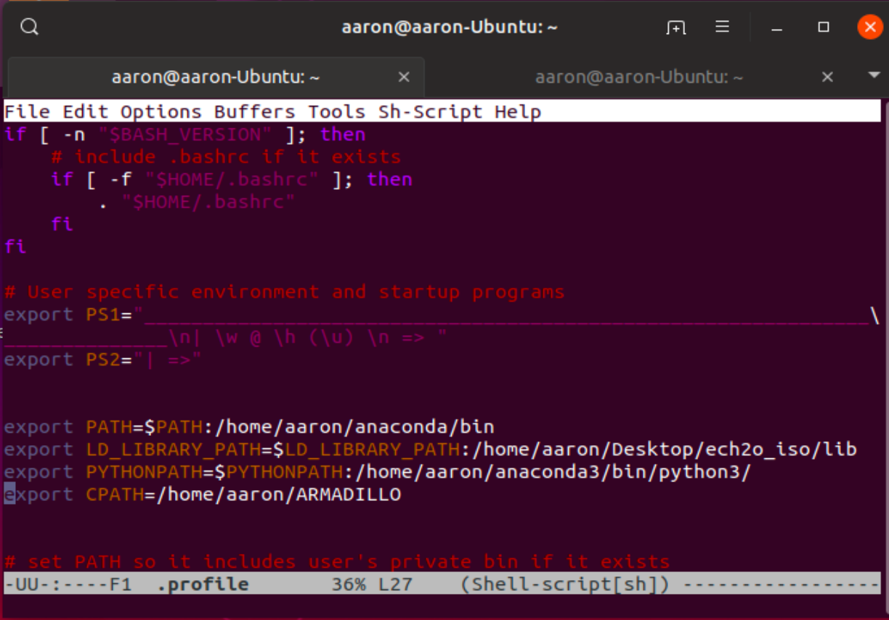
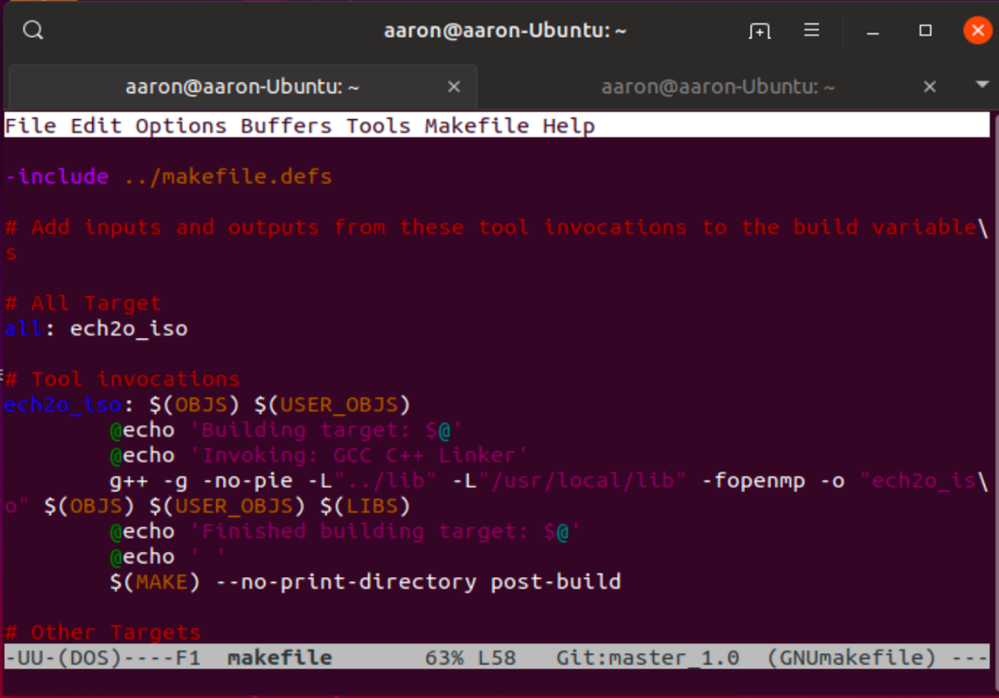

# Installation: compiling the code

The following page contains information on how to compile the latest
version of EcH2O-iso, whose executable is `ech2o`.

The current version of EcH2O-iso does not have a configure
script. The Makefile has been generated for the gnu c++ compiler and
does not check for dependencies. MINGW or CYGWIN is necessary to compile
in Windows.

EcH2O-iso uses PCRASTER as data pre- and post-processor.
Please install PCRASTER free of charge from
[here](https://pcraster.geo.uu.nl/downloads/latest-release/).

## 1\. Dependencies

  - Change directory to your workspace and clone the latest version of
    the source files from the git repository:

<!-- end list -->

    $ git clone http://bitbucket.igb-berlin.de:7990/scm/~ech2o/ech2o_iso.git

  - Install the armadillo development files, either compiling and
    installing from source or from the package manager of your Linux
    distribution.

  - Precompiled versions of the libcsf dependency for Linux, Windows and
    Mac are included in the `lib` folder. The compilation was carried
    assuming little endian 64 bit architectures.
    
    If the linker complains, the library may need to be compiled for
    your system. Please, clone the source code from

<!-- end list -->

    $ git clone https://bitbucket.org/maneta/libcsf.git

or download from

    $  https://sourceforge.net/p/pcraster/rasterformat/ci/master/tree/

and compile from source. Then replace the old libcsf64 library in the
`lib` directory with the newly compiled library. Make sure you change
the name of the new library so it has the same name as the old one.

## 2\. Making `ech2o_iso`

For local Linux systems (full admin rights)
  - Install python `sudo apt install python3`
  - Install numpy `sudo apt-get install python3-pip` and `sudo pip3 install numpy scipy`
  - Install cmake `sudo apt-get -y install cmake`
  - Install anaconda
	a.	Download anaconda3 (.sh file) to the Download folder
	b.	(Terminal command) `bash ~/Downloads/Anaconda3-… .sh`
  - Install blas and lapack `sudo apt-get install libblas-dev liblapack-dev`
  - Install boost `sudo apt-get install libboost-all-dev`
  - Install git `apt-get install git-core`
  - Download aramdillo - unpack to a directory with only `armadillo` and `armadillo_bits` directories
  - Install emacs `sudo apt-get install emacs`
  - Install bash (check if installed using `which bash`)
  - Clone and follow installation for netcdf cxx4 (below) 

   `$ https://github.com/Unidata/netcdf-cxx4`

  - Modify the `.profile` (or `.bash_profile') for PATH,LD_LIBRARY_PATH,PYTHONPATH,CPATH
	- May be necessary to include hdf5 location in CPATH (e.g. `CPATH=/usr/include/hdf5/serial`)

For Alternative Linux systems (partial admin rights)
  - set up install directory

  `$ export DEST=/some/path`

  - install OpenBlas

`  $ cd OpenBLAS-0.3.7`

`  $ make`

`  $ make install PREFIX=$DEST`

  - install LAPACK

`  $ cd lapack`

`  $ mkdir build && cd build`

`  $ cmake -DBUILD_SHARED_LIBS=ON -DCMAKE_INSTALL_LIBDIR=$DEST/lib ..`

`  $ cmake --build -j . --target installw`

  - install ARMADILLO

`  $ cd armadillo`

`  $ cmake .`

`  $ cmake . -DCMAKE_INSTALL_PREFIX:PATH=$DEST`

`  $ make`

`  $ make install`

  - install arpack-ng

`  $ cd arpack-ng`

`  $ mkdir build && cd build`

`  $ cmake -DEXAMPLES=OFF -DMPI=ON -DBUILD_SHARED_LIBS=ON -DCMAKE_INSTALL_PREFIX:PATH=$DEST ..`

`  $ make `

`  $ make install`

  - install superlu

`  $ cd superlu`

`  $ mkdir build && cd build`

`  $ cmake -DBUILD_SHARED_LIBS=ON -DCMAKE_INSTALL_PREFIX=$DEST ..`

`  $ make `

`  $ make install`

  - compiling EcH2O-ISO

`  $ cd ech2o_iso/Release-Linux`

`  $ export LD_LIBRARY_PATH=$DEST/lib:$DEST/lib64:$LD_LIBRARY_PATH`

  - edit *mk files
	- Replacing:

`  $ g++ -DCPU_LITTLE_ENDIAN -I"../includes" ...`
 	- with 

`  $ g++ -DCPU_LITTLE_ENDIAN -I"../includes" -I"${DEST}/include" ...`

  - Find and update `LD_LIBRARY_PATH` to include boost

`  $ export BOOSTDIR= … `

`  $ export LD_LIBRARY_PATH=$BOOSTDIR/lib:$LD_LIBRARY_PATH`

  - edited the g++ line in `Release-Linux/makefile`
	- from 

`  $ g++ -L"../lib" -L"/usr/local/lib" -fopenmp ...`
	- to

`  $ g++ -L"../lib" -L"/usr/local/lib" -L"${DEST}/lib64" -L"${DEST}/lib" -L"${BOOSTDIR}/lib" -I"${DEST}/include"  -I"${BOOSTDIR}/include/boost" -fopenmp ...`

To check for all installations
  - Check the libraries folder in ech2o/lib for `libarmadillo.so` , create symolic link in directory if libary is not located here
  - Change to the `Release` folder within the source folder
  - If compiling for Windows, edit the objects.mk file and substitute
    item `-lcsf64` for `-llibcsf64` so that `make` will link against the
    correct static library. Save and close the editor
  - If compiling for Mac, edit the objects.mk file and substitute item
    `-lcsf64` for `-lcsfosx` so that `make` will link against the
    correct static library. Save and close the editor
  - from the command line type `make` to make the source.
  - If compiling gets stuck with `relocation of R_X86...` edit makefile to include `-no-pie`

## 3\. Making `asc2c`

  - Open a command line terminal
  - Change directory to your workspace and clone the latest version of
    the source files from the git repository:

<!-- end list -->

    $ git clone https://bitbucket.org/maneta/asc2c.git

  - Change directory into the source folder and type `make` to make the
    code.

### 4\. Contact

If you need assistance compiling the source, contact
<marco.maneta@umontana.edu>

If you find this documentation to be incomplete, please file a ticket in
the appropriate issue tracker:

  - asc2c compilation issues:
    <https://bitbucket.org/maneta/asc2c/issues>
