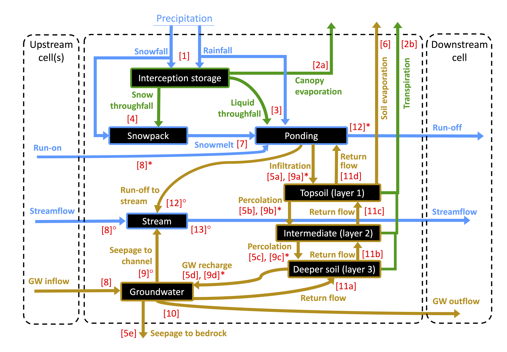

.. |ech2o| replace:: EcH\ :sub:`2`\ O

|ech2o|-iso 2.0
===============

|ech2o|-iso builds on the **physically-based, spatially distributed ecohydrologic model EcH**\ :sub:`2`\ **O** developed in C++ in the Regional Hydrology Lab at the University of Montana (Maneta and Silverman, 2013) (`link <http://hs.umt.edu/RegionalHydrologyLab/software/default.php>`_).

The specifity of |ech2o|-iso is the implementation of stable water isotopes (:sup:`2`\ H and :sup:`18`\ O) and age tracking.
It is mostly based on an immediate, complete implicit scheme for mixing water transiting between compartments within time steps (Fig. 1).
Evaporative fractionation of isotopes is also included.

   **Figure 1.** Water compartments (black rectangles) and fluxes (coloured arrows) as represented in |ech2o| and used for isotope and age tracking in |ech2o|-iso, with the numbers between brackets reflecting the sequence of calculation within a time step. Note that water routing (steps [8] to [13]) differs between cells where a stream is present (◦) or not (∗). 

The Latest Version
------------------

The latest stable version can be found in the *master_1.0* branch of the `source repository <https://bitbucket.org/sylka/master_1.0/>`_. 

Documentation
-------------

The documentation for installing an runnnig |ech2o|-iso, available as of the date of this release, can be found on its `ReadTheDocs webpage <http://ech2o-iso.readthedocs.io/en/latest/>`_.
  
Third-party dependencies
------------------------

|ech2o|-iso depends on the following third-party libraries with the following licenses:
  
- armadillo (Mozilla Public License 2.0) and dependencies therein 
- libcsf (BSD License)
  
For convenience, precompiled versions of the libcsf librairies for Linux, Windows 64 bit, and Mac architectures are distributed with the source code.   

Compilation of source code
--------------------------

Please see the fille called INSTALL.rst

Data Preprocessing
------------------

|ech2o|-iso uses the PCRASTER map format (a cross-system format) for data pre- and post-processing, and for visulalization. 
PCRASTER can be downloaded free of charge from http://pcraster.geo.uu.nl/downloads

Licensing
---------

Please see the file called LICENSE.txt.

Bugs
____

Should you encounter any bug, please file a ticket `here <https://bitbucket.org/sylka/ech2o_iso/issues>`_.
Known issues can be found there, as well as on the `main EcH2O page <https://bitbucket.org/maneta/ech2o/issues>`_.

How to Cite
-----------

Please, acknowledge the use of |ech2o|-iso by citing:

- Kuppel, S., Tetzlaff, D., Maneta, M. P., and Soulsby, C. (2018). |ech2o|-iso 1.0: Water isotopes and age tracking in a process-based, distributed ecohydrological model, Geosci. Model Dev., 11, 3045-3069, `<https://doi.org/10.5194/gmd-11-3045-2018>`_.

Further references (and useful reads!):

- Kuppel, S., Tetzlaff, D., Maneta, M. P., and Soulsby, C. (2018). What can we learn from multi-data calibration of a process-based ecohydrological model?. Environmental Modelling & Software, 101, 301–316.
- Maneta, M and Silverman, N (2013). A spatially-distributed model to simulate water, energy and vegetation dynamics using information from regional climate models. Earth Interactions, 17, 1-44.
- Lozano-Parra, J., Maneta, M. P., and Schnabel, S. (2014). Climate and topographic controls on simulated pasture production in a semiarid Mediterranean watershed with scattered tree cover. Hydrology and Earth System Sciences, 18, 1439.
  
Contacts
--------

  If you have any questions please, contact marco.maneta@umontana.edu.
